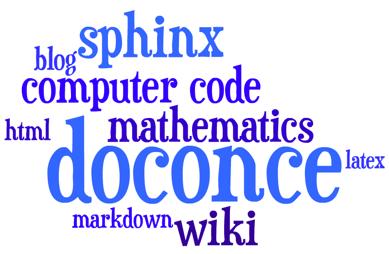
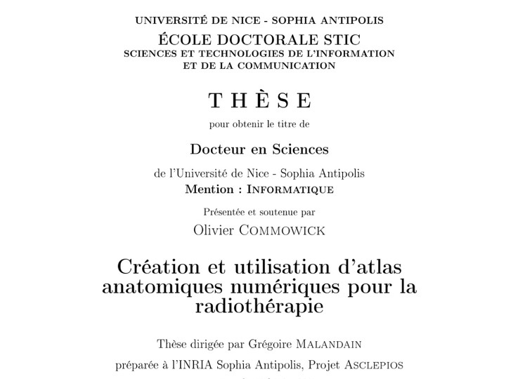
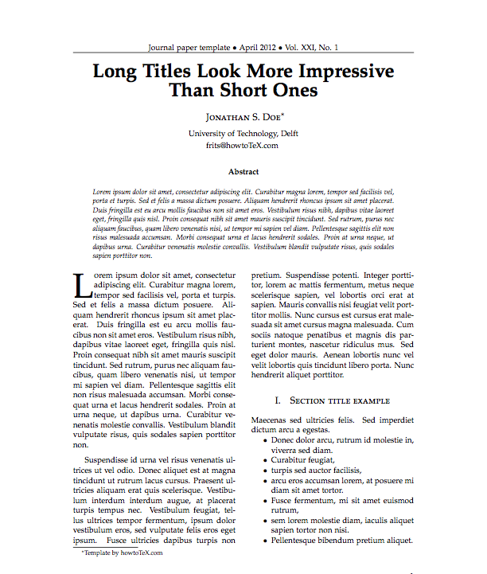

<!-- TITLE: On the Technicalities of Scientific Writing Anno 2012: The DocOnce Way -->
<!-- TITLE: Scientific Writing Anno 2013: The DocOnce Way -->
% Scientific Writing and Publishing Anno 2013
% **Hans Petter Langtangen**
% Sep 9, 2014

<!-- latex interprets 9 = as chapter and then needs book style... -->
<!-- !split -->
# Challenges with tools for scientific writing

<!-- !split -->
## Scientific writing = LaTeX

 * Pre 1980: Handwriting + publisher (paper or book)
 * Post 1985: scientists write LaTeX
 * Post 1995: publish LaTeX on the web and in journals and books

~~~~~~~~~~~~~~~~~~~~~~~~~~~~~~~~~~~~~~~~~~~~~~~~~~~~~~~~~~~~~~~
\providecommand{\shadedskip}{}
\definecolor{shadecolor}{rgb}{0.87843, 0.95686, 1.0}
\renewenvironment{shadedskip}{
\def\FrameCommand{\colorbox{shadecolor}}\FrameRule0.6pt
\MakeFramed {\FrameRestore}\vskip3mm}{\vskip0mm\endMakeFramed}
\providecommand{\shadedquoteBlue}{}
\renewenvironment{shadedquoteBlue}[1][]{
\bgroup\rmfamily\fboxsep=0mm\relax
\begin{shadedskip}
\list{}{\parsep=-2mm\parskip=0mm\topsep=0pt\leftmargin=2mm
\rightmargin=2\leftmargin\leftmargin=4pt\relax}
\relax}{\endlist\end{shadedskip}\egroup}\begin{shadedquoteBlue}
\fontsize{9pt}{9pt}
\begin{Verbatim}
print 'Hello, World!'
\end{Verbatim}
~~~~~~~~~~~~~~~~~~~~~~~~~~~~~~~~~~~~~~~~~~~~~~~~~~~~~~~~~~~~~~~

*Big late 1990s question:* 
Will MS Word replace LaTeX? It never did!

<!-- !split -->
## Scientific publishing needs to address new media

<!-- !bslidecell 00 0.4 -->

<!-- FIGURE: [fig/mbair, width=400] -->

<!-- !eslidecell -->

<!-- !bslidecell 01 0.6 -->

<!-- !eslidecell -->

<!-- !split -->
## The book will probably survive

<!-- !split -->
## The classical report will survive

<!-- !bslidecell 00 -->

<!-- !eslidecell -->

<!-- !bslidecell 01 -->

<!-- !eslidecell -->

<!-- !split -->
<!-- * Scientific writing = lecture notes, slides, reports, thesis, books,  ... -->
<!-- * (Journal papers typeset by journals are out of scope) -->

## Scope of this presentation

  * Focus: documents with much *math* and *computer code*
  * Key question: What tools should I use for scientific writing?

The default answer is LaTeX, but there are many
recent popular alternative tools: HTML w/MathJax,
Sphinx, Markdown, MediaWiki, IPython notebook.

<!-- !bslidecell 00 0.25 -->

<!-- !eslidecell -->

<!-- !bslidecell 01 0.25 -->

<!-- !eslidecell -->

<!-- !bslidecell 02 0.5 -->

<!-- !eslidecell -->

<!-- !bslidecell 10 0.25 -->

<!-- !eslidecell -->

<!-- !bslidecell 11 0.25 -->

<!-- !eslidecell -->

<!-- !bslidecell 12 0.5 -->

<!-- !eslidecell -->

<!-- !split -->
## Does your scientific writing today need to address new media (in the future)?

<!-- Insert links here to reports -->

<!-- !bslidecell 00 0.4 -->
 * BW paper
 * Color paper
 * Slides
 * Web w/design
 * Wiki
 * Blog
 * Notebook
 * ...

<!-- !eslidecell -->

<!-- !bslidecell 01 0.6 -->

<!-- !eslidecell -->

<!-- !split -->

## Can we factor pieces from a heterogeneous world to one coherent piece in the future?

When I write some scientific material,

 * a LaTeX document,
 * a blog post (HTML),
 * some web pages (HTML),
 * a Sphinx document,
 * an IPython notebook,
 * some Markdown files,

and later want to collect the pieces into a larger document, maybe
some book, or one big web document, or a set of slides,
is that at all feasible?

<!-- !bpop highlight-red -->
Probably not, but I have a solution :-)
<!-- !epop -->

<!-- !split -->
## Popular tools anno 2013 and their math support

<!-- !bpop -->
 * **LaTeX**: de facto standard for math-instensive documents
 * **pdfLaTeX**, **XeLaTeX**, **LuaLaTeX**: takes over (figures in png, pdf) - use these!
 * **MS Word**: too clicky math support and ugly fonts, but much used
 * **HTML with MathJax**: "full" LaTeX *math*, but much tagging
 * **Sphinx**:
   somewhat limited LaTeX math support, but great support for web design,
   and less tagged than HTML
 * **reStructuredText**: similar to Sphinx, but no math support, transforms to
   lots of formats (LaTeX, HTML, XML, Word, OpenOffice, ...)
 * **Markdown**: somewhat limited LaTeX math support, but minor tagging,
   transforms to lots of formats (LaTeX, HTML, XML, Word, OpenOffice, ...)
 * **IPython notebooks**: Markdown code/math,
   combines Python code, interactivity, and
   visualization, but requires all code snippets to sync together
 * **MediaWiki**: quite good LaTeX math support (cf. Wikipedia/Wikibooks)
 * Other **wiki** formats: no math support, great for collaborative editing
 * **Wordpress**: supports LaTeX *formulas* only, but good blog post support
 * **Google blogger**: supports full HTML with MathJax
 * **Epydoc**: old tool for Python code documentation
 * **Plain text for email**: no math, just raw LaTeX, and no tagging

<!-- !epop -->

<!-- !split -->

## LaTeX is very rich; other tools support much less

 * LaTeX inline math: works with all (LaTeX, MathJax, Sphinx, Markdown, MediaWiki)
 * LaTeX equation math:
    * **LaTeX**: `equation*`, `equation`, `align*`, `align` +
      `eqnarray`, `split`, `alignat`, ... (numerous!)
    * **MathJax**: `equation*`, `equation`, `align*`, `align`
    * **MediaWiki**: `equation*`, `equation`, `align*`, `align`
    * **Sphinx**: `equation*`, `equation`, `align*`
    * **Markdown**: `equation*`, `equation`, `eqnarray*`, `align*` (but no labels)

<!-- !split -->
## LaTeX is very rich; other tools support much less

<!-- !bpop -->
 * Figures: all
 * Subfigures: LaTeX (`subfigure`)
 * Movies: LaTeX, raw HTML
 * Floating computer code: LaTeX; fixed computer code: all
 * Interactive programs: Sphinx, IPython notebook, raw HTML
 * Floating tables: LaTeX; fixed tables: all
 * Algorithms: LaTeX
 * Margin notes: LaTeX, HTML with tailored css code
 * Page references: LaTeX
 * Footnotes: LaTeX, Sphinx, reStructuredText, MediaWiki
 * Bibliography: LaTeX, Sphinx, reStructuredText, MediaWiki
 * Hyperlinks: all (but not on paper!)

<!-- !epop -->

<!-- !bpop -->
Conclusion: Highly non-trivial to translate a LaTeX document into something
based on HTML and vice versa.
<!-- !epop -->

<!-- !split -->
## Typesetting concerns I

<!-- !bpop -->
 * Sphinx refers to figures by the caption (has to be short!) and
   strips away any math notation (avoid that!).
 * Sphinx refers to sections by the title, but removes math in the
   reference, so avoid math in headlines.
 * Tables cannot be referred to by numbers and have to appear at
   fixed positions in the text.
 * Computer code has to appear at fixed positions in the text.
 * Algorithms must be written up using basic elements like lists or
   paragraphs with headings.
 * Recipes are often typeset as enumerated lists. For recipes with
   code or math blocks: drop the list (gives problems in some formats)
   and use paragraph (or subsubsection) headings with "Step 1.",
   "Step 2.", etc.

<!-- !epop -->

<!-- !split -->
## Typesetting concerns II

<!-- !bpop -->
 * Footnotes must appear as part of the running text (e.g., sentences
   surrounded by parenthesis), since only a few formats support footnotes.
 * Sphinx does not handle code blocks where the first line is indented.
 * Multiple plots in the same figure: mount the plots to one image
   file and include this (`montage` for png, gif, jpeg; `pdftk`, `pdfnup`,
   and `pdfcrop` for PDF).
 * If you need several equations *numbered* in an `align` environment,
   recall that Sphinx, Markdown, and MediaWiki cannot handle this,
   although they have LaTeX math support.
 * Markdown tolerates labels in equations but cannot refer to them.

<!-- !epop -->

<!-- Not valid anymore: -->
<!-- Keys for items in the bibliography are made visible by Sphinx so -->
<!-- "bibitems" a la BibTeX must look sensible and consistent. -->

<!-- !split -->
## Typesetting concerns III

<!-- !bpop -->
 * Index words can appear anywhere in LaTeX, but should be outside
   paragraphs in other tools.
 * References to tables, program code and algorithms can only be
   made in LaTeX.
 * Figures are floating in LaTeX, but fixed in other tools, so place
   figures exactly where they are needed the first time.
 * Curve plots with color lines do not work well in black-and-white
   printing. Make sure plots makes sense in color and BW (e.g., by
   using colors *and* markers).

<!-- !epop -->

<!-- !split -->
## Solution I: Use a format that translates to many

 * Sphinx can do nice HTML, LaTeX, epub, (almost) plain text,
   man pages, Gnome devhelp files, Qt help files, texinfo, JSON
 * Markdown can do LaTeX, HTML, MS Word, OpenOffice, XML,
   reStructuredText, epub, DocBook, ... but not Sphinx
 * IPython notebook: can do LaTeX, reStructuredText, HTML, PDF,
   Python script
 * Sphinx and Markdown has some limited math support

<!-- !split -->
## Solution II: Use DocOnce

[DocOnce](http://hplgit.github.io/doconce/doc/web/index.html)
offers minimalistic typing, great flexibility wrt format,
especially for scientific writing with *much math and code*.

 * Can generate LaTeX, HTML, Sphinx, Markdown, MediaWiki, Google wiki,
   Creole wiki, reST, plain text
 * Made for large science books *and* small notes
 * Targets paper and screen
 * Many special features (code snippets from files, embedded movies,
   admonitions, modern LaTeX layouts, ...)
 * Very effective for generating slides from ordinary text
 * Applies Mako: DocOnce text is a program (!)
 * Much like Markdown, less tagged than LaTeX, HTML, Sphinx
<!-- latex interprets 9 = as chapter and then needs book style... -->

<!-- !split -->
# DocOnce

<!-- !split -->
## DocOnce demos

<http://hplgit.github.com/teamods/writing_reports/>

 * LaTeX-based PDF [for screen](http://hplgit.github.com/teamods/writing_reports/_static/report.pdf), [for printing](http://hplgit.github.com/teamods/writing_reports/_static/report_4printing.pdf), [for phone](http://hplgit.github.com/teamods/writing_reports/_static/report_4phone.pdf)
 * [Plain HTML](http://hplgit.github.com/teamods/writing_reports/_static/report_do.html) or with a [template](http://hplgit.github.com/teamods/writing_reports/_static/report_vagrant.html) or [another template](http://hplgit.github.com/teamods/writing_reports/_static/report_github_minimal.html) or [solarized](http://hplgit.github.com/teamods/writing_reports/_static/report_solarized.html)
 * Sphinx: [agni](http://hplgit.github.com/teamods/writing_reports/_static/sphinx-agni/index.html), [pyramid](http://hplgit.github.com/teamods/writing_reports/_static/sphinx-pyramid/report.html), [classy](http://hplgit.github.com/teamods/writing_reports/_static/sphinx-classy/report.html), [fenics](http://hplgit.github.com/teamods/writing_reports/_static/sphinx-fenics_minimal/report.html), [redcloud](http://hplgit.github.com/teamods/writing_reports/_static/sphinx-redcloud/report.html)
 * HTML for [Google](http://doconce-report-demo.blogspot.no/) or [Wordpress](http://doconcereportdemo.wordpress.com/) for blog posts
 * [MediaWiki](http://doconcedemo.shoutwiki.com/wiki/DocOnce_demo_page) (Wikipedia, Wikibooks, etc)
 * DocOnce [source code](http://hplgit.github.com/teamods/writing_reports/_static/report.do.txt.html) and [tutorial](http://hplgit.github.io/doconce/doc/pub/tutorial/html/index.html)

<!-- !split -->
## DocOnce disclaimer

 * Based on text transformations (reg.exp.) so valid syntax may
   occasionally give problems
<!-- * Actively developed and maintained, but one-man show -->

*DocOnce divorce.* 
At any time one can divorce from DocOnce and marry one of the output
formats, such as LaTeX or Sphinx. The generated code is clean.

<!-- !split -->
## DocOnce experience: code generation is a great thing

Regardless of what format you write in, introduce a step where
you can generate (parts of) the syntax.

 * Use a preprocessor a la Mako
 * Write your own read-and-generate code
 * or both (like DocOnce)

Advantages:

 * Less writing
 * Repository of syntax for nice constructions
 * Implements structure/rules across documents
 * Easier to change layout/structure

<!-- !split -->
### Example: generate reveal.js or deck.js slides from HTML

 * Write the content of each slide in plain HTML(5)
 * Use e.g. `#slide` as delimiter between slides
 * Read file, splitting wrt `#slide` yields a list of
   slides (HTML code)
 * For a specific format (reveal.js, deck.js, csss, ...):
    * write header
    * for slide in slides:
      * embed slide in correct HTML code

    * write footer

~~~~~~~~~~~~~~~~~~~~~~~~~~~~~~~~~~~~~~~~~~~~~~~~~~~~~~~~{.HTML}
<h2>Scope of this presentation</h2>
<ul>
  <li>Focus: documents with much <em>math</em> and
      <em>computer code</em>
  <li>Key question: What tools should I use for scientific writing?
</ul>

The default answer is LaTeX.

~~~~~~~~~~~~~~~~~~~~~~~~~~~~~~~~~~~~~~~~~~~~~~~~~~~~~~~~~~~~~~~

<!-- !split -->

# A tour of DocOnce

<!-- !split -->
## Title, authors, date, toc

~~~~~~~~~~~~~~~~~~~~~~~~~~~~~~~~~~~~~~~~~~~~~~~~~~~~~~~~~~~~~~~
TITLE: Some Title
AUTHOR: name1 at institution1, with more info & institution2
AUTHOR: name2 email:name2@web.com at institution
DATE: today

# A table of contents is optional:
TOC: on
~~~~~~~~~~~~~~~~~~~~~~~~~~~~~~~~~~~~~~~~~~~~~~~~~~~~~~~~~~~~~~~

*Notice.* 
Title and authors must have all information *on a single line*!

<!-- !split -->
## Abstract

~~~~~~~~~~~~~~~~~~~~~~~~~~~~~~~~~~~~~~~~~~~~~~~~~~~~~~~~~~~~~~~
__Abstract.__
Here goes the abstract...
~~~~~~~~~~~~~~~~~~~~~~~~~~~~~~~~~~~~~~~~~~~~~~~~~~~~~~~~~~~~~~~

Or:

~~~~~~~~~~~~~~~~~~~~~~~~~~~~~~~~~~~~~~~~~~~~~~~~~~~~~~~~~~~~~~~
__Summary.__
Here goes the summary...
~~~~~~~~~~~~~~~~~~~~~~~~~~~~~~~~~~~~~~~~~~~~~~~~~~~~~~~~~~~~~~~

<!-- !split -->
## Section headings

Headings are surrounded by `=` signs:

~~~~~~~~~~~~~~~~~~~~~~~~~~~~~~~~~~~~~~~~~~~~~~~~~~~~~~~~~~~~~~~
========= This is an H1/chapter heading =========

======= This is an H2/section heading =======

===== This is an H3/subsection heading =====

=== This is an H4/paragraph heading ===

__This is a paragraph heading.__
~~~~~~~~~~~~~~~~~~~~~~~~~~~~~~~~~~~~~~~~~~~~~~~~~~~~~~~~~~~~~~~

Result:

# This is an H1/chapter heading

## This is an H2/section heading

### This is an H3/subsection heading

#### This is an H4/paragraph heading

*This is a paragraph heading.*

<!-- !split -->
## Markup and lists

~~~~~~~~~~~~~~~~~~~~~~~~~~~~~~~~~~~~~~~~~~~~~~~~~~~~~~~~~~~~~~~
 * Bullet list items start with `*`
   and may span several lines
 * *Emphasized words* are possible
 * _Boldface words_ are also possible
 * color{red}{colored words} too
 * `inline verbatim code` is featured
   o and sublists with enumerated items starting with `o`
   o items are just indented as you would do in email
~~~~~~~~~~~~~~~~~~~~~~~~~~~~~~~~~~~~~~~~~~~~~~~~~~~~~~~~~~~~~~~

This gets rendered as

 * Bullet lists start with `*`
   and may span several lines
 * *Emphasized words* are possible
 * **Boldface words** are also possible
 * colored words too
 * `inline verbatim code` is featured
  1. and sublists with enumerated items starting with `o`
  2. items are just indented as you would do in email

<!-- !split -->
## Labels, references, index items

~~~~~~~~~~~~~~~~~~~~~~~~~~~~~~~~~~~~~~~~~~~~~~~~~~~~~~~~~~~~~~~
# Insert index items in the source
idx{key word1} idx{key word2}

# Label
===== Some section =====
\label{this:section}

# Make reference
As we saw in Section ref{this:section}, references, index
items and labels follow a syntax similar to LaTeX
but without backslashes.

# Make reference to equations
See \eqref{eq1}-\eqref{myeq}.

# Make hyperlink
"some link text": "https://github.com/hplgit/doconce"

# Hyperlink with complete URL as link text
URL: "https://github.com/hplgit/doconce"
~~~~~~~~~~~~~~~~~~~~~~~~~~~~~~~~~~~~~~~~~~~~~~~~~~~~~~~~~~~~~~~

<!-- !split -->
## Figures and movies

*Important:* 
Figures with HTML and LaTeX size info, and caption: *everything on one line*

~~~~~~~~~~~~~~~~~~~~~~~~~~~~~~~~~~~~~~~~~~~~~~~~~~~~~~~~~~~~~~~
FIGURE: [figdir/myfig, width=300 frac=1.2] My caption. \label{fig1}
~~~~~~~~~~~~~~~~~~~~~~~~~~~~~~~~~~~~~~~~~~~~~~~~~~~~~~~~~~~~~~~

Movies are also supported:

~~~~~~~~~~~~~~~~~~~~~~~~~~~~~~~~~~~~~~~~~~~~~~~~~~~~~~~~~~~~~~~
MOVIE: [http://youtu.be/IDeGDFZSYo8, width=420 height=315]
~~~~~~~~~~~~~~~~~~~~~~~~~~~~~~~~~~~~~~~~~~~~~~~~~~~~~~~~~~~~~~~

and rendered as

<iframe width="420" height="315" src="http://www.youtube.com/embed/IDeGDFZSYo8" frameborder="0" allowfullscreen></iframe>

<!-- !split -->
## Math

Inline math as in LaTeX:

~~~~~~~~~~~~~~~~~~~~~~~~~~~~~~~~~~~~~~~~~~~~~~~~~~~~~~~~~~~~~~~
...where $a=\int_{\Omega}fdx$ is an integral.
~~~~~~~~~~~~~~~~~~~~~~~~~~~~~~~~~~~~~~~~~~~~~~~~~~~~~~~~~~~~~~~

gets rendered as ...where $a=\int_{\Omega}fdx$ is an integral.

An equation environment is surrounded by `!bt` and `!et` tags,
the rest is plain LaTeX:

~~~~~~~~~~~~~~~~~~~~~~~~~~~~~~~~~~~~~~~~~~~~~~~~~~~~~~~~~~~~~~~
!bt
\begin{align}
\frac{\partial u}{\partial t} &= \nabla^2 u,
\label{a:eq}\\ 
\nabla\cdot\pmb{v} & = 0
\label{b:eq}
\end{align}
!et
~~~~~~~~~~~~~~~~~~~~~~~~~~~~~~~~~~~~~~~~~~~~~~~~~~~~~~~~~~~~~~~

which is rendered as

$$
\begin{equation}
\frac{\partial u}{\partial t} = \nabla^2 u,
\label{a:eq}
\end{equation}
$$

$$
\begin{equation}  
\nabla\cdot\pmb{v}  = 0
\label{b:eq}
\end{equation}
$$

<!-- !split -->
## Math flexibility

Limit math environments to

~~~~~~~~~~~~~~~~~~~~~~~~~~~~~~~~~~~~~~~~~~~~~~~~~~~~~~~~~~~~~~~
\[ ... \]

\begin{equation*}
\end{equation*}

\begin{equation}
\end{equation}

\begin{align*}
\end{align*}

\begin{align}
\end{align}
~~~~~~~~~~~~~~~~~~~~~~~~~~~~~~~~~~~~~~~~~~~~~~~~~~~~~~~~~~~~~~~

*DocOnce fix of shortcomings.* 
 * Sphinx, Markdown, and MediaWiki cannot have
   `align` with labels
 * MathJax (HTML, Sphinx, Markdown, Mediawiki, ...) cannot
   handle equation references across web pages

<!-- !split -->
## Displaying code

Code is enclosed in `!bc` and `!ec` tags:

~~~~~~~~~~~~~~~~~~~~~~~~~~~~~~~~~~~~~~~~~~~~~~~~~~~~~~~~~~~~~~~
!bc pycod
def solver(I, a, T, dt, theta):
    """Solve u'=-a*u, u(0)=I, for t in (0,T] with steps of dt."""
    dt = float(dt); N = int(round(T/dt)); T = N*dt
    u = zeros(N+1); t = linspace(0, T, N+1)

    u[0] = I
    for n in range(0, N):
        u[n+1] = (1 - (1-theta)*a*dt)/(1 + theta*dt*a)*u[n]
    return u, t
!ec
~~~~~~~~~~~~~~~~~~~~~~~~~~~~~~~~~~~~~~~~~~~~~~~~~~~~~~~~~~~~~~~

This gets rendered as

~~~~~~~~~~~~~~~~~~~~~~~~~~~~~~~~~~~~~~~~~~~~~~~~~~~~~~~~{.Python}
def solver(I, a, T, dt, theta):
    """Solve u'=-a*u, u(0)=I, for t in (0,T] with steps of dt."""
    dt = float(dt); N = int(round(T/dt)); T = N*dt
    u = zeros(N+1); t = linspace(0, T, N+1)

    u[0] = I
    for n in range(0, N):
        u[n+1] = (1 - (1-theta)*a*dt)/(1 + theta*dt*a)*u[n]
    return u, t
~~~~~~~~~~~~~~~~~~~~~~~~~~~~~~~~~~~~~~~~~~~~~~~~~~~~~~~~~~~~~~~

<!-- !split -->
## Copying code from source files

We recommend to copy as much code as possible directly from the
source files:

~~~~~~~~~~~~~~~~~~~~~~~~~~~~~~~~~~~~~~~~~~~~~~~~~~~~~~~~~~~~~~~
@@@CODE path/to/file
@@@CODE path/to/file   fromto: start-regex@end-regex
~~~~~~~~~~~~~~~~~~~~~~~~~~~~~~~~~~~~~~~~~~~~~~~~~~~~~~~~~~~~~~~

For example, copying a code snippet starting with `def solver(` and
ending with (line not included) `def next(x, y,` is specified by
start and end regular expressions:

~~~~~~~~~~~~~~~~~~~~~~~~~~~~~~~~~~~~~~~~~~~~~~~~~~~~~~~~~~~~~~~
@@@CODE src/somefile.py  fromto: def solver\(@def next\(x,\s*y,
~~~~~~~~~~~~~~~~~~~~~~~~~~~~~~~~~~~~~~~~~~~~~~~~~~~~~~~~~~~~~~~

<!-- !split -->
## Typesetting of code is implied by the file extension

 * `.py`: `pypro` if complete file, `pycod` if snippet
 * `.pyopt`: visualized execution via the [Online Python Tutor](http://pythontutor.com)
 * `.f`, `.f90`, `f.95`: `fpro` and `fcod`
 * `.cpp`, `.cxx`: `cpppro` and `cppcod`
 * `.c`: `cpro` and `ccod`
 * `.*sh`: `shpro` and `shcod`
 * `.m`: `mpro` and `mcod`
 * `ptex2tex`: between 40+ code styles in LaTeX
 * `pygments` is used for code in HTML (ca 10 styles)

<!-- !split -->
## Demonstrating code execution; Online Python Tutor
<a name="slide:opt"/>

With `!bc pyoptpro` or a file `*.pyopt`, the code applies the
[Online Python Tutor](http://pythontutor.com) for displaying
program flow and state of variables:

~~~~~~~~~~~~~~~~~~~~~~~~~~~~~~~~~~~~~~~~~~~~~~~~~~~~~~~~{.Python}
def solver(I, a, T, dt, theta):
    dt = float(dt)
    N = int(round(T/dt))
    T = N*dt
    u = [0.0]*(N+1)
    t = [i*dt for i in range(N+1)]

    u[0] = I
    for n in range(0, N):
        u[n+1] = (1 - (1-theta)*a*dt)/(1 + theta*dt*a)*u[n]
    return u, t

u, t = solver(I=1, a=1, T=3, dt=1., theta=0.5)
print u
~~~~~~~~~~~~~~~~~~~~~~~~~~~~~~~~~~~~~~~~~~~~~~~~~~~~~~~~~~~~~~~

<!-- !split -->
## Demonstrating code execution; Sage Cell Server
<a name="slide:sage:cell"/>

With `!bc pyscpro` or a file `*.pysc`, the code is typeset in
a sage cell:

~~~~~~~~~~~~~~~~~~~~~~~~~~~~~~~~~~~~~~~~~~~~~~~~~~~~~~~~{.Python}
a = 2
b = 3
print 'a+b:', a + b

# In a sage cell we can also plot
from matplotlib.pyplot import *
from numpy import *
x = linspace(0, 4*pi, 101)
y = exp(-0.1*x)*cos(x)
plot(x, y)
xlabel('x'); ylabel('y')
show()
~~~~~~~~~~~~~~~~~~~~~~~~~~~~~~~~~~~~~~~~~~~~~~~~~~~~~~~~~~~~~~~

*Warning.* 
Works only in Sphinx documents (but HTML support is possible).

<!-- !split -->
## Demonstrating code execution; IPython notebook
<a name="slide:ipynb"/>

Can take a [DocOnce source](http://hplgit.github.com/teamods/writing_reports/_static/report.do.txt.html) and transform to an [IPython notebook](http://nbviewer.ipython.org/url/hplgit.github.com/teamods/writing_reports/_static/report.ipynb) with [source](http://hplgit.github.com/teamods/writing_reports/_static/report.ipynb.html)

<!-- !split -->
## Tables

~~~~~~~~~~~~~~~~~~~~~~~~~~~~~~~~~~~~~~~~~~~~~~~~~~~~~~~~~~~~~~~

  |--------------------------------|
  |time  | velocity | acceleration |
  |---r-------r-----------r--------|
  | 0.0  | 1.4186   | -5.01        |
  | 2.0  | 1.376512 | 11.919       |
  | 4.0  | 1.1E+1   | 14.717624    |
  |--------------------------------|

~~~~~~~~~~~~~~~~~~~~~~~~~~~~~~~~~~~~~~~~~~~~~~~~~~~~~~~~~~~~~~~

Gets rendered as

    time        velocity    acceleration  
------------  ------------  ------------  
         0.0        1.4186         -5.01  
         2.0      1.376512        11.919  
         4.0        1.1E+1     14.717624  

<!-- !split -->
## Newcommands for math

 * `newcommands*.tex` files contain newcommands
 * Used directly in LaTeX
 * Substitution made for many other formats

<!-- !split -->
## Labels, citations, index, bibliography

Lables, citations, index, and bibliography follow the ideas of
LaTeX, but without backslashes:

~~~~~~~~~~~~~~~~~~~~~~~~~~~~~~~~~~~~~~~~~~~~~~~~~~~~~~~~~~~~~~~
===== My Section =====
\label{sec:mysec}

idx{key equation} idx{$\u$ conservation}

We refer to Section ref{sec:yoursec} for background material on
the *key equation*. Here we focus on the extension

!bt
\begin{equation}
\Ddt{\u} = \mycommand{v} \label{mysec:eq:Dudt}
\end{equation}
!et
Equation \eqref{mysec:eq:Dudt} is important, see
cite{Larsen_et_al_2002,Johnson_Friedman_2010a}.
Also, cite{Miller_2000} supports such a view.

Figure ref{mysec:fig:myfig} displays the features.

FIGURE: [fig/myfile, width=600] My figure. \label{mysec:fig:myfig}

===== References =====

BIBFILE: papers.pub
~~~~~~~~~~~~~~~~~~~~~~~~~~~~~~~~~~~~~~~~~~~~~~~~~~~~~~~~~~~~~~~

The `papers.pub` file must be in [Publish](https://bitbucket.org/logg/publish)
format (easy to make from BibTeX).

<!-- !split -->
## Exercises

DocOnce offers a special format for *exercises*, *problems*, *projects*,
and *examples*:

~~~~~~~~~~~~~~~~~~~~~~~~~~~~~~~~~~~~~~~~~~~~~~~~~~~~~~~~~~~~~~~
===== Problem: Flip a Coin =====
\label{demo:ex:1}
files=flip_coin.py, flip_coin.pdf
solutions=mysol.txt, mysol_flip_coin.py
keywords = random numbers; Monte Carlo simulation

!bsubex
Make a program that simulates flipping a coin $N$ times.

!bhint
Use `r = random.random()` and define head as `r <= 0.5`.
!ehint
!esubex

!bsubex
Compute the probability of getting heads.

!bans
0.5.
!eans
!esubex
~~~~~~~~~~~~~~~~~~~~~~~~~~~~~~~~~~~~~~~~~~~~~~~~~~~~~~~~~~~~~~~

<!-- !split -->
## Rendering of the previous page

<!-- --- begin exercise --- -->

### Problem 1: Flip a Coin
<!-- keywords = random numbers; Monte Carlo simulation -->

*a)*
Make a program that simulates flipping a coin $N$ times.

<!-- --- begin hint in exercise --- -->

*Hint.*
Use `r = random.random()` and define head as `r <= 0.5`.

<!-- --- end hint in exercise --- -->

*b)*
Compute the probability of getting heads.

<!-- --- begin answer of exercise --- -->
*Answer.*
0.5.

<!-- --- end answer of exercise --- -->

Filenames: `flip_coin.py`, `flip_coin.pdf`.
<!-- solution files: mysol.txt, mysol_flip_coin.py -->

<!-- --- end exercise --- -->

<!-- !split -->
## Exercises

All *exercises*, *problems*, and *projects* in a document are parsed
and available in a data structure (list of dicts) for further
processing (e.g., making a book of problems).

~~~~~~~~~~~~~~~~~~~~~~~~~~~~~~~~~~~~~~~~~~~~~~~~~~~~~~~~~~~~~~~
[{'answer': '',
  'closing_remarks': '',
  'file': ['flip_coin.py', 'flip_coin.pdf'],
  'hints': [],
  'keywords': ['random numbers', 'Monte Carlo simulation'],
  'label': 'demo:ex:1',
  'solution_file': ['mysol.txt', 'mysol_flip_coin.py'],
  'subex': [{'answer': '',
             'file': None,
             'hints': ['Use `r = random.random()` ...'],
             'solution': '',
             'text': 'Make a program that simulates ...'},],
  'title': 'Flip a Coin',
  'type': 'Problem'}]
~~~~~~~~~~~~~~~~~~~~~~~~~~~~~~~~~~~~~~~~~~~~~~~~~~~~~~~~~~~~~~~

<!-- !split -->
## Use of preprocessors

 * Simple if-else tests a la the C/C++ preprocessor
 * `FORMAT` variable can be used to test on format, e.g.,
    * if latex/pdflatex do one sort of code (raw LaTeX)
    * if html, do another type of code (raw HTML)

 * Easy to comment out large portions of text
 * Easy to make different versions of the document
 * The mako preprocessor is really powerful - gives a
   complete programming language inside the document!

<!-- !split -->
## DocOnce admonitions

*Use with caution!* 
Such environments may light up the document, but can be disturbing too.
Some admon styles have icons.

*Going deeper.* 
More details can be separated from the rest.

*Time for review!* 
Tasks:

  * Maybe ask a question?
  * Or two?

Conclusion:

  * A special "block" admonition has less pronounced typesetting and
    can be used when no special icon is desired. Good for slides.

<!-- !split -->
## Slides

Very effective way to generate slides from running text:

 * Take a copy of your DocOnce prose
 * Strip off as much text as possible
 * Emphasize key points in bullet items
 * Focus on key equations, figures, movies, key code snippets
 * Insert `!split` wherever you want a new slide to begin
 * Insert `!bpop` and `!epop` around elements to pop up
   in sequence
 * Use 7 `=` or 5 `=` in headings (H2 or H3)
 * Supported slide types: Beamer, HTML,
   HTML5 (reveal.js, deck.js, csss, dzslides)

<!-- !split -->
## Example on slide code

~~~~~~~~~~~~~~~~~~~~~~~~~~~~~~~~~~~~~~~~~~~~~~~~~~~~~~~~~~~~~~~
!split
======= Headline =======

 * Key point 1
 * Key point 2
 * Key point 3: Although long
   bullet points are not recommended in general, we need
   it here for demonstration purposes to investigate
   what happens with the slide layout where there is
   so much text under one point

FIGURE: [fig/teacher1, width=100 frac=0.4]

Key equation:

!bt
\[ -\nabla^2 u = f \quad\hbox{in }\Omega \]
!et

And maybe a final comment?

!split
======= Next slide... =======
~~~~~~~~~~~~~~~~~~~~~~~~~~~~~~~~~~~~~~~~~~~~~~~~~~~~~~~~~~~~~~~

<!-- !split -->
## Example on slide code

Last page gets rendered to

## Headline

 * Key point 1
 * Key point 2

Key equation:

$$
 -\nabla^2 u = f \quad\hbox{in }\Omega 
$$

And maybe a final comment?

<!-- !split -->
## Grid layout of slide: MxN cells

Example with a bullet list to the left and
a figure to the right (two cells: 00 and 01):

~~~~~~~~~~~~~~~~~~~~~~~~~~~~~~~~~~~~~~~~~~~~~~~~~~~~~~~~~~~~~~~
!split
======= Headline =======

!bslidecell 00
!bpop
 * Key point 1
 * Key point 2
 * Key point 3
!epop

!bpop
!bt
\[ -\nabla^2 u = f \quad\hbox{in }\Omega \]
!et
!epop

!eslidecell

!bslidecell 01
FIGURE: [fig/broken_pen_and_paper, width=400, frac=0.8]
!eslidecell

!split
======= Next slide... =======
~~~~~~~~~~~~~~~~~~~~~~~~~~~~~~~~~~~~~~~~~~~~~~~~~~~~~~~~~~~~~~~

<!-- !split -->
## Grid layout of slide: MxN cells

Last page gets rendered to

## Headline

<!-- !bslidecell 00 -->
<!-- !bpop -->
 * Key point 1
 * Key point 2
 * Key point 3

<!-- !epop -->

<!-- !bpop -->
$$
 -\nabla^2 u = f \quad\hbox{in }\Omega 
$$
<!-- !epop -->

<!-- !eslidecell -->

<!-- !bslidecell 01 -->

<!-- !eslidecell -->

<!-- !split -->
## Classic slide types

 * LaTeX Beamer
 * Plain HTML w/various styles
   * separate slides w/navigation
   * one big slide

<!-- !split -->
## HTML5 slide types

<!-- !bpop -->
 * Supported HTML5 packages:
   * [reveal.js](http://lab.hakim.se/reveal-js/)
   * [deck.js](http://imakewebthings.com/deck.js/)
   * [dzslides](http://paulrouget.com/dzslides/)
   * [csss](http://leaverou.github.com/csss/#intro)

 * **Problem**: each package has its own syntax (though similar)
   * **Solution**: slide code is autogenerated from DocOnce

 * **Problem**: reveal and deck have numerous styles
   * **Solution**: easy [to autogenerate all styles](http://hplgit.github.com/teamods/doconce/demo/index.html) for a talk

 * **Problem**: HTML5 slides need many style files
   * **Solution**: autocopy all files to talk directory

 * **Problem**: original versions of the styles have too large fonts,
   centering, and other features not so suitable for lectures
   with much math and code
   * **Solution**: DocOnce contains adjusted css files

<!-- !epop -->

<!-- !split -->
## DocOnce to HTML

Run in terminal window:

~~~~~~~~~~~~~~~~~~~~~~~~~~~~~~~~~~~~~~~~~~~~~~~~~~~~~~~~~~~~~~~
doconce format html doconcefile

# Solarized HTML style
doconce format html doconcefile --html_solarized

# Control pygments typesetting of code
doconce format html doconcefile --pygments_html_style=native

# Or use plain <pre> tag for code
doconce format html doconcefile --no_pygments_html

# Further making of slides
doconce slides_html doconcefile reveal --html_slide_theme=darkgray
~~~~~~~~~~~~~~~~~~~~~~~~~~~~~~~~~~~~~~~~~~~~~~~~~~~~~~~~~~~~~~~

<!-- !split -->
## Output for blog posts

Two formats of blog posts are supported:

 * Google's [blogspot.com](http://doconce-report-demo.blogspot.no/):
   just paste the raw HTML (full support of math and code)
 * [Wordpress](http://doconcereportdemo.wordpress.com/):
   despite limited math, DocOnce manipulates the math
   such that even `equation` and `align` work in Wordpress :-)

For wordpress, add `--wordpress`:

~~~~~~~~~~~~~~~~~~~~~~~~~~~~~~~~~~~~~~~~~~~~~~~~~~~~~~~~~~~~~~~
doconce format html doconcefile --wordpress
~~~~~~~~~~~~~~~~~~~~~~~~~~~~~~~~~~~~~~~~~~~~~~~~~~~~~~~~~~~~~~~

and paste the code into the text area.

<!-- !split -->
## DocOnce to pdfLaTeX

~~~~~~~~~~~~~~~~~~~~~~~~~~~~~~~~~~~~~~~~~~~~~~~~~~~~~~~~~~~~~~~
doconce format pdflatex doconcefile

# Result: doconcefile.p.tex (ptex2tex file)
# Run either
ptex2tex doconcefile
# or
doconce ptex2tex doconcefile -DHELVETICA envir=minted

pdflatex doconcefile
bibtex doconcefile
pdflatex doconcefile

# More control of how code is typeset
doconce format pdflatex doconcefile --minted_latex_style=trac
doconce ptex2tex doconcefile envir=minted

doconce format pdflatex doconcefile
doconce ptex2tex doconcefile envir=ans:nt
~~~~~~~~~~~~~~~~~~~~~~~~~~~~~~~~~~~~~~~~~~~~~~~~~~~~~~~~~~~~~~~

<!-- !split -->
## DocOnce to Sphinx

~~~~~~~~~~~~~~~~~~~~~~~~~~~~~~~~~~~~~~~~~~~~~~~~~~~~~~~~~~~~~~~
doconce format sphinx doconcefile

# Autocreate sphinx directory
doconce sphinx_dir theme=pyramid doconcefile

# Copy files and build HTML document
python automake-sphinx.py

google-chrome sphinx-rootdir/_build/html/index.html
~~~~~~~~~~~~~~~~~~~~~~~~~~~~~~~~~~~~~~~~~~~~~~~~~~~~~~~~~~~~~~~

Much easier than running the Sphinx tools manually!

<!-- !split -->
## Output for wiki

Only MediaWiki supports math.

~~~~~~~~~~~~~~~~~~~~~~~~~~~~~~~~~~~~~~~~~~~~~~~~~~~~~~~~~~~~~~~
doconce format mwiki doconcefile
~~~~~~~~~~~~~~~~~~~~~~~~~~~~~~~~~~~~~~~~~~~~~~~~~~~~~~~~~~~~~~~

Recommended site:

 * [ShoutWiki](http://doconcedemo.shoutwiki.com/wiki/DocOnce_demo_page)
   for standard wikis

Publishing of "official" documents:

 * [Wikibooks](http://en.wikibooks.org/wiki/Wikibooks:WIW)
   (can test code in the [sandbox](http://en.wikibooks.org/wiki/Wikibooks:Sandbox))
 * Wikipedia

<!-- !split -->
## DocOnce to other formats

~~~~~~~~~~~~~~~~~~~~~~~~~~~~~~~~~~~~~~~~~~~~~~~~~~~~~~~~~~~~~~~
doconce format pandoc doconcefile  # (Pandoc extended) Markdown
doconce format gwiki  doconcefile  # Googlecode wiki
doconce format cwiki  doconcefile  # Creole wiki (Bitbucket)
doconce format rst    doconcefile  # reStructuredText
doconce format plain  doconcefile  # plain, untagged text for email
~~~~~~~~~~~~~~~~~~~~~~~~~~~~~~~~~~~~~~~~~~~~~~~~~~~~~~~~~~~~~~~

<!-- !split -->
## Installation

 * Ubuntu: `sudo apt-get install python-doconce` (old!)
 * Source at [GitHub](https://github.com/hplgit/doconce) (recommended!)
   * `hg clone` + `sudo python setyp.py install`

 * Many [dependencies...](http://hplgit.github.io/doconce/doc/pub/manual/html/manual.html#installation-of-doconce-and-its-dependencies)
   * Must have `preprocess` and `mako`
   * Need `latex`, `sphinx`, `pandoc`, etc. (see the [Installation](http://hplgit.github.io/doconce/doc/pub/manual/html/manual.html#installation-of-doconce-and-its-dependencies) description)
   * Easy for slides: only `preprocess` is needed :-)

<!-- !split -->
## Writing tips for LaTeX writers who want to convert to DocOnce

 * `doconce latex2doconce` helps the translation
 * Use `\[ \]`, `equation`, `equation*`, `align`, `align*` and nothing more for
   equations
 * Figures: avoid subfigures (combine image files instead), use `\includegraphics`, have captions after graphics, use short figure captions, position exactly where needed
 * Tables: have them inline (not floating), with no caption
 * Computer codes: have them inline (not floating)
 * Avoid footnotes, `pageref`
 * Do not use *algorithm* environments, use simple list formatting instead
 * Avoid math in section headings
 * Use `pdflatex` or `xetex`
 * Use BibTeX (can easily be converted to [publish](https://bitbucket.org/logg/publish) used by DocOnce)
 * Use `\href` for links (and insert links frequently)
 * Use the `bm` package for boldface $\boldsymbol{u}$
 * Place all newcommands in a separate file, with one definition per line
   (multiline definitions goes to a separate LaTeX preamble file in DocOnce)
 * Avoid all fancy LaTeX constructs - more backslashes than needed in math
   and sections is a bad thing...

<!-- !split -->
## DocOnce writing tips

<!-- * See the previous *Typesetting concerns I, II and III* slides for issues when writing -->
<!-- for multiple formats. However: DocOnce makes a fix so that Sphinx and -->
<!-- other formats works with labels in align environments :-) -->

Figures and movies:

 * Prepare figures in the right format: EPS for `latex`, PDF for `pdflatex`,
   PNG, GIF or JPEG for HTML formats (`html`, and HTML output from
   `sphinx`, `rst`, `pandoc`). One can omit the figure file extension and
   `doconce` will pick the most appropriate file for the given output format.
 * Let plotting programs produce both PDF/EPS and PNG files.
   (Recall that PDF and EPS are vector graphics formats that can scale to
   any size with much higher quality than PNG or other bitmap formats.)
 * Use `doconce combine_images` to combine several images into one.
 * Store all figures in a directory (tree) with name `fig` or `fig-X`,
   where `X` is some short logical name for the current document.
 * Store all movies in a directory (tree) with name `mov` or `mov-X`.
 * Favor the movie formats MP4, WebM, and Ogg (best suited for modern browsers).

<!-- !split -->
## DocOnce writing tips

 * `\boldsymbol{u}` gives nicer boldface typesetting of math symbols than
   the alternatives `\boldsymbol{u}` and `\pmb{u}`.
 * For HTML-based formats using MathJax, `\boldsymbol{u}` is not supported
   and therefore automatically replaced by `\boldsymbol{u}` by DocOnce.
 * Use `\formula` in math expressions to color a part.
 * Not all LaTeX math is supported by MathJax. Some legal LaTeX math
   might give MathJax problems - then one has to rewrite the expression
   to find a syntax that works both with LaTeX and MathJax.
 * Use `doconce spellcheck *.do.txt` to automatically spellcheck files.
 * Avoid page references and footnotes.

<!-- !split -->
## Writing tips for sphinx and other formats

For output formats different from `latex`, `pdflatex`, and `html`:

 * Use labels only right after section headings and in equations.
 * Be careful with labels in `align` math environments: `pandoc`
   and `mwiki` cannot refer to them.
 * `sphinx` output requires
   * no math in section headings or figure captions
     (gets removed in references).
   * running text to start in column 1.
   * progressive section headings: after chapter (9 `=`) comes
     section (7 `=`), then subsection (5 `=`), then paragraph
     (3 `=`). Do not make jumps in this progression.
   * index entries (``) before the paragraph where they
     are introduced and place them *before* subsubsection
     headings (`=== ... ===`) and after subsection and section headings.
   * a line of text and no comment or math before code or list.

